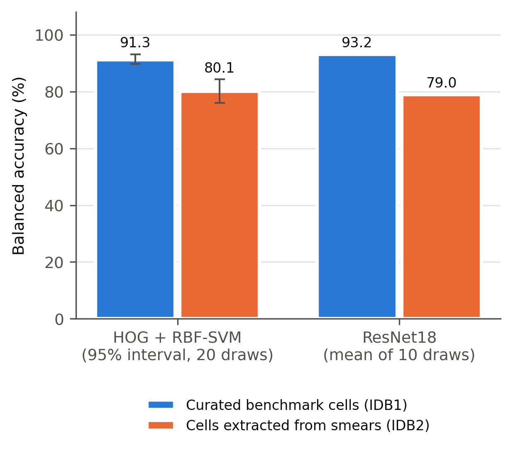
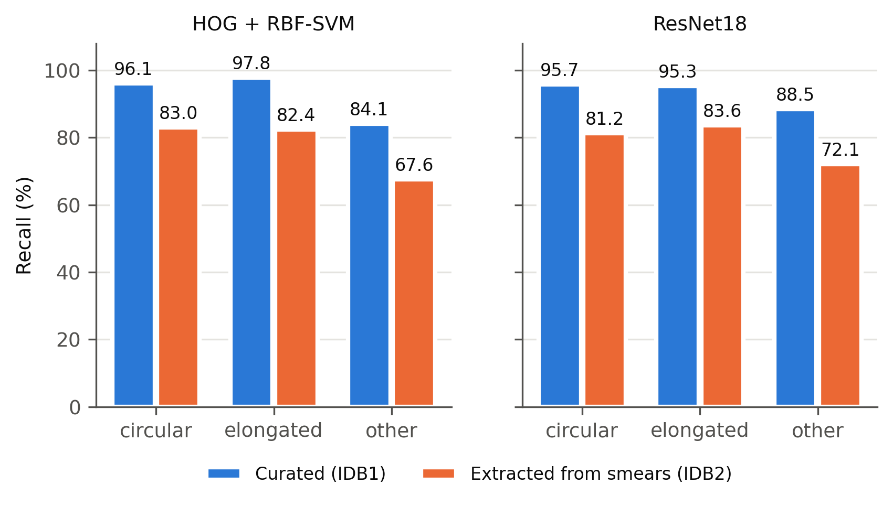
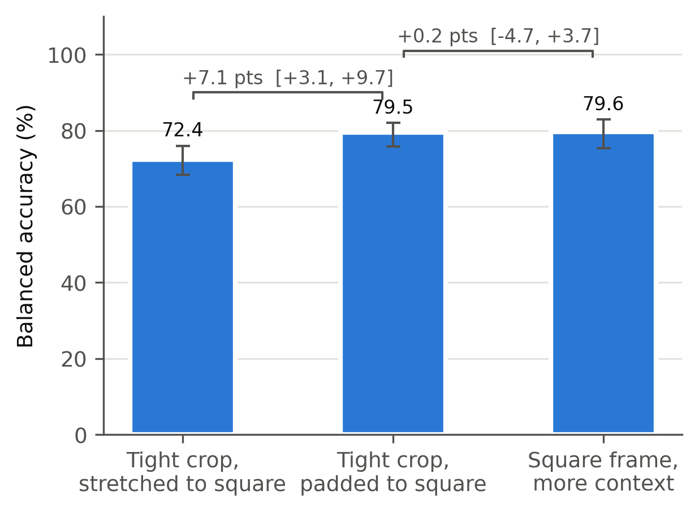
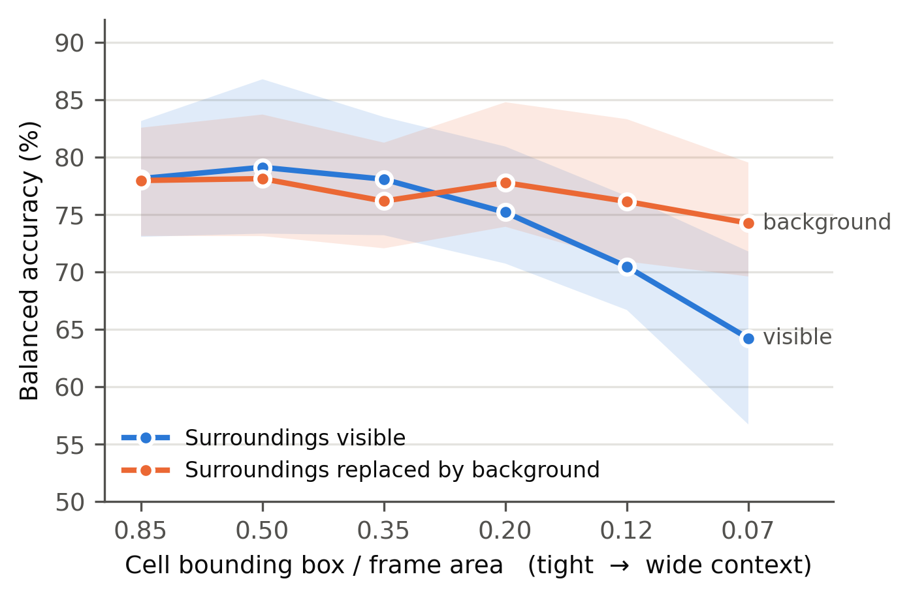

# Benchmark curation and crop geometry affect reported accuracy of sickle cell morphology classification

David Olusegun Adekoya1,*

1Department of Information Technology, Federal University of Technology Akure, Ondo State, Nigeria

*Corresponding author: adekoyadift2020@futa.edu.ng

## ABSTRACT

Automated classification of red blood cell shape supports the diagnosis of sickle cell disease where expert microscopy is scarce, and published models report accuracies above 96% on a widely used public benchmark. Those evaluations use cell images that the dataset curators selected individually and balanced across classes, so it is not known whether the reported performance describes cells as they occur on a peripheral blood smear. This study compares the curated cell images of that benchmark with cells extracted from annotated full-field smear images in the same dataset, holding preprocessing, features, models and evaluation protocol identical. All comparisons were class-balanced and size-matched, using paired subsampling over repeated stratified cross-validation, and reported as balanced accuracy with percentile intervals. Balanced accuracy was 91.3% on curated cells and 80.1% on smear-extracted cells, a difference of 11.2 percentage points that a fine-tuned residual network reproduced at 14.2 points. The difference persisted after controlling for class balance, sample size, extraction quality, image resolution, blur and contrast. Crop geometry was a second, separable source of variation: resizing non-square cell crops to a square input distorted cell shape and alone reduced balanced accuracy by 7.1 points, reducing recall on elongated cells from 85.2% to 68.5%. Additional surrounding smear context produced no benefit and wide context reduced accuracy by up to 10.0 points, while grouping cross-validation folds by source smear changed nothing. Benchmarks for this task should include smear-level cell populations, and studies should report how cell crops are constructed.

Keywords: sickle cell disease, red blood cell morphology, benchmark validity, medical image classification, evaluation methodology, peripheral blood smear

## 1. INTRODUCTION

Sickle cell disease is among the most common inherited blood disorders, and its burden falls disproportionately on sub-Saharan Africa, where most affected births occur and where diagnostic capacity is weakest [1], [2], [3]. Polymerisation of sickle haemoglobin deforms erythrocytes into elongated shapes that are visible on a stained peripheral blood smear, so quantifying cell shape is directly informative for diagnosis and monitoring [4]. Laboratory techniques for detecting the disease range from electrophoresis and chromatography to point-of-care immunoassays, each with distinct cost and infrastructure requirements [21], and image-based morphology remains attractive where those are unavailable [24]. Because expert microscopy review is scarce in the settings with the greatest need, automated morphology classification is an attractive form of decision support [5], [6], and reviews of artificial intelligence applied to sickle cell disease [20] and of deep learning in microscopy image analysis [34] report rapid growth in this literature. Interest in low-cost acquisition has grown alongside it, with annotated microscopy image resources assembled specifically to support deep learning on inexpensive instruments [18], and with work on the storage and transmission of large red blood cell image collections [19].

Work on this task is anchored on one public benchmark, erythrocytesIDB, which contains Giemsa-stained smear images from patients with sickle cell disease together with a set of individual cell images labelled circular, elongated, or other [7]. Reported performance on those cell images is high. The dataset authors obtained F-measures of 0.97 and 0.95 for normal and elongated cells using shape descriptors [8]. Convolutional networks and transfer learning report accuracies above 98% [9], and a subsequent study reported up to 100% precision and recall on a subset and 98.58% test accuracy for a fine-tuned network after augmenting the dataset [10]. Related pipelines report comparable figures on adjacent tasks such as overlapping cell separation and blood smear morphology classification [11], [12], [13]. Comparable accuracies are reported for neural classification of sickle cells [26], [32], [33], for shape-aware classification of erythroid cells [36], for automated blood cell detection [35] and for explainable blood cell classifiers [37], while computational analysis of whole smears has been shown to detect disease-associated cytomorphologies at scale [22]. Complementary work characterises cell deformation geometrically [29], [30] or physically, through deformability measured from microscopy [25] and shape response to hypoxia at the point of care [28], and smartphone-based acquisition has been demonstrated for sickle cell identification [27].

These results describe a specific population of cells. The benchmark's individual cell images were selected by the dataset curators, are centred in their frame, and are approximately balanced across the three classes. A deployed system does not see that population. It sees every cell on a smear, in natural class proportions, including borderline shapes and cells in crowded fields. Whether reported accuracy survives that change of population has not been tested, although dataset bias and evaluation design are recognised as sources of optimism in medical image analysis more broadly [14], [15].

### 1.1 Contributions

This study makes four contributions. First, it constructs a smear-level cell population from the same dataset that supplies the curated benchmark, using the dataset's own per-class masks, so that the two populations can be compared without introducing an external cohort. Second, it quantifies the difference in balanced accuracy between curated and smear-extracted cells under identical preprocessing, features, models and evaluation, with intervals obtained from paired subsampling. Third, it isolates crop geometry as a separable and previously unreported source of variation in results on this benchmark, showing that the common practice of resizing a non-square cell crop to a square network input distorts elongated cells and depresses the class of greatest clinical interest. Fourth, it reports two negative results that constrain plausible explanations: smear-grouped cross-validation does not change performance, and surrounding smear context does not improve cell classification.

### 1.2 Research questions

The evaluation is organised around four questions. The first concerns whether balanced accuracy differs between curated benchmark cells and cells extracted from smears in the same dataset when every other element of the pipeline is held constant. The second asks which properties of the data and the evaluation account for any difference, considering class balance, sample size, extraction quality, image resolution, image quality, crop geometry and border truncation in turn. The third asks whether the difference is specific to hand-crafted features or also appears with a fine-tuned convolutional network. The fourth asks whether the surrounding smear carries information that improves classification of an individual cell.

### 1.3 Related work

Table 1 summarises the principal studies on this benchmark and on closely related morphology tasks. Reported accuracies are high and stable across methods, and evaluation is generally conducted on curated individual cell images. Two recurring characteristics are relevant here. Evaluation protocols are not always reported in sufficient detail to establish the unit of splitting or the order of augmentation relative to splitting, a concern that has been raised generally for machine-learning-based science [15]. Where dataset expansion is used to compensate for small sample size, the relationship between the augmented population and the clinical population is not examined. Generalisation on this benchmark has been addressed by ensemble methods and feature-importance analysis [23], which improve robustness within the curated cell population but do not change the population on which performance is measured. The composition of the labelled set itself has received less attention, although crowdsourced tagging of smear images from patients with sickle cell disease has been used to expand annotation beyond expert readers [31].

Table 1. Review of related works

| Study (year) | Data | Method | Reported performance | Limitations |
|---|---|---|---|---|
| González-Hidalgo et al. (2015) [7] | erythrocytesIDB, full-field and individual cells | Cluster separation from digital images | Benchmark release | Segmentation-oriented; defines the curated cell set used by later work |
| Delgado-Font et al. (2020) [8] | erythrocytesIDB individual cells | Active contour segmentation; circular and elliptical shape factors | F-measure 0.97 normal, 0.95 elongated | Curated cells only; by the dataset authors |
| Alzubaidi et al. (2020) [9] | erythrocytesIDB and additional sets | Transfer learning, feature extraction, support vector machine | Above 98% accuracy | Evaluated on curated cells; protocol not characterised here |
| Jennifer et al. (2023) [10] | erythrocytesIDB, augmented to 10,002 images | Five transfer-learning backbones with ablation | Up to 100% on a subset; 98.58% test accuracy | Order of augmentation relative to splitting not stated |
| Vicent et al. (2022) [11] | Sickle cell smear images | Algorithm for overlapping cell detection | Task-specific | Overlap handled as a segmentation problem, not an evaluation-design one |
| Deo et al. (2024) [12] | Sickle cell red blood cell images | Hybrid convolutional and recurrent model | High reported accuracy | Curated cell images; no smear-level population |
| Ahmad et al. (2026) [13] | Blood smear cell images | Explainable hybrid involution–convolution network | High reported accuracy | Explanation focus; benchmark realism not examined |
| Machado et al. (2024) [5] | Systematic review of sickle cell disease studies | Review of machine-learning applications | Identifies small datasets, overfitting, interpretability as recurring weaknesses | Does not test benchmark composition empirically |
| Luo et al. (2025) [14] | Multiple medical imaging datasets | Adaptive agreement learning to mitigate dataset bias | Bias mitigation | General method; not applied to haematology morphology |

## 2. METHOD

### 2.1 Dataset

The study used erythrocytesIDB Version 2, obtained from its public repository, with archive checksum verified on download. The archive contains 1,299 images and no accompanying metadata files. Images are Giemsa-stained peripheral blood smears acquired with a light microscope at 100x magnification and a consumer camera, classified by a single specialist in clinical laboratory science.

The curated arm comprised the individual cell images of subset erythrocytesIDB1: 625 cells, of which 202 were circular, 211 elongated and 212 other. The dataset documentation lists 629 such cells; four were absent from the archive.

The smear arm was derived from subset erythrocytesIDB2, which supplies 50 full-field images of 3136 x 2352 pixels, each with per-class binary masks provided at one-quarter of source resolution. Subset erythrocytesIDB3 was excluded from the main comparisons because its source images are 267 x 200 pixels, which would confound image resolution with population. One erythrocytesIDB2 folder lacked a circular-class mask and contributed cells of the remaining two classes only.

### 2.2 Cell extraction

Cells were obtained as connected components of each per-class mask, thresholded at mid-grey because the masks are stored in a lossy format. Components smaller than 10^-4 of the mask area, subject to a floor of 20 pixels, with a source-resolution side below 20 pixels, or with a bounding-box aspect ratio above 4, were discarded as fragments or mask noise; this removed 19 of 2,263 initially extracted cells, or 0.8%. Cells touching the image border were excluded.

Each retained cell was cropped as a square frame centred on its bounding box and sized so that the bounding box occupied 35.2% of the frame area, this being the median value measured on the curated cell images. Cells whose frame would extend beyond the image were excluded. Depending on the analysis, the smear arm comprised between 1,767 and 1,876 cells drawn from 50 smears.

### 2.3 Features and models

For the classical pipeline, images were converted to greyscale, resized to 64 x 64 pixels and described by histogram-of-oriented-gradients features with 9 orientations, 8 x 8 pixel cells, 2 x 2 blocks and L2-Hys normalisation, giving 1,764 dimensions [16]. Classification used a support vector machine with a radial basis function kernel, regularisation constant 10 and class-balanced weights, applied after standardisation. A random forest and a ridge classifier were used in secondary analyses.

For the deep learning pipeline, an 18-layer residual network [17] initialised with weights pretrained on a large natural-image corpus was fine-tuned on greyscale images replicated to three channels and resized to 96 x 96 pixels. Greyscale input was chosen because the two arms differ markedly in colour, as reported in Section 3.3. Optimisation used AdamW with learning rate 3 x 10^-4, weight decay 10^-4, batch size 32 and 12 epochs, with random quarter-turn rotations and horizontal flips applied within training folds only.

### 2.4 Evaluation protocol

Every comparison was class-balanced and size-matched: each arm was subsampled to an equal number of cells per class, 100 unless otherwise stated. Performance was estimated by stratified five-fold cross-validation, and the primary metric was balanced accuracy, chosen because the natural smear population is strongly imbalanced and plain accuracy is uninformative under that imbalance. For the classical pipeline, subsampling was repeated over 20 draws paired across arms by random seed, and results are reported as the mean with a 95% percentile interval across draws, including for paired differences. The residual network was evaluated over 10 draws, reported as the mean with the range across folds.

### 2.5 Controls

Candidate explanations for a curated–smear difference were tested in sequence: smear-grouped rather than cell-level cross-validation folds; class balance and sample size; extraction quality and image resolution, including downsampling smear crops to the curated native size; image quality, by blurring and contrast-matching curated images to smear-image statistics; cross-arm transfer; crop geometry, comparing a tight non-square crop resized to square, the same crop padded to square, and a square frame with context, on identical cells; border truncation; and surrounding context at six framing levels, each paired with a masked twin in which pixels outside the dilated cell mask were replaced by the frame's median background so that context could be separated from apparent cell size.

## 3. RESULTS AND DISCUSSION

### 3.1 Smear-grouped splitting does not change performance (RQ2)

Within the smear arm, grouping cross-validation folds by source smear did not reduce performance relative to cell-level folds. The difference was -0.43 percentage points for the ridge classifier, -0.45 for the random forest and -0.49 for the support vector machine, smear-grouped performance being marginally higher in each case. Shared acquisition conditions between training and test folds, a recognised source of optimistic results in machine-learning-based science [15], therefore do not explain the findings that follow. The dataset originates from a single laboratory and protocol, leaving little between-smear variation for a model to exploit.

### 3.2 Smear-extracted cells are classified substantially worse (RQ1, RQ3)

Under the balanced, size-matched comparison with undistorted square crops, balanced accuracy was 91.3% on curated cells and 80.1% on smear-extracted cells, a paired difference of 11.2 percentage points (Table 2). The residual network reproduced the effect at 14.2 points. Per-class recall (Table 3) shows the shortfall spread across all three classes rather than concentrated in one.

Table 2. Balanced accuracy on curated and smear-extracted cells, class-balanced and size-matched at 100 cells per class.

| Model | Curated cells | Smear-extracted cells | Difference |
|---|---|---|---|
| Histogram of oriented gradients with support vector machine | 91.3 (89.8–93.2) | 80.1 (76.0–84.3) | 11.2 (6.4–15.5) |
| Residual network, 18 layers | 93.2 (fold range 83.3–98.3) | 79.0 (fold range 65.0–93.3) | 14.2 |

Table 3. Per-class recall (%) for both models.

| Class | Curated, classical | Smear, classical | Curated, network | Smear, network |
|---|---|---|---|---|
| Circular | 96.1 | 83.0 | 95.7 | 81.2 |
| Elongated | 97.8 | 82.4 | 95.3 | 83.6 |
| Other | 84.1 | 67.6 | 88.5 | 72.1 |

Figure 1. Balanced accuracy on curated benchmark cells and on cells extracted from smears in the same dataset, class-balanced and size-matched.

Figure 2. Per-class recall on curated and smear-extracted cells for each model.

### 3.3 Image quality and resolution do not explain the difference (RQ2)

The two arms differ visibly in appearance: median hue 173 against 286 degrees, saturation 0.129 against 0.210, greyscale contrast 0.084 against 0.041 and sharpness, measured as the variance of the Laplacian, 3.7 x 10^-4 against 2.7 x 10^-4. The dataset documentation describes a single acquisition protocol for all subsets, so these differences are an empirical observation rather than a documented design feature. Colour cannot act on the greyscale pipelines used here. Blurring the curated images to below smear-image sharpness and matching their contrast changed curated balanced accuracy by only -0.3 points, from 92.7% to 92.4%. Because the block normalisation of the feature descriptor is largely contrast-invariant, this test is informative for blur and weak for contrast. Downsampling smear crops from a median native side of 303 pixels to the curated native size of 80 pixels left the difference unchanged at 11.4 points (6.2–15.5). Excluding border-touching cells and clipped frames reduced it from 12.5 to 10.5 points. Table 4 summarises the controls.

Table 4. Effect of each control on the curated–smear difference in balanced accuracy.

| Control applied | Difference (percentage points) |
|---|---|
| Class balance and sample size matched, distorted crops | 22.0 to 22.9 |
| Restricted to high-resolution subset, suspect crops removed | 22.2 to 23.5 |
| Curated images blurred and contrast-matched to smear images | 22.0 (curated changed by only -0.3) |
| Undistorted square crops at matched framing | 11.2 (6.4–15.5) |
| Additionally downsampled to curated native resolution | 11.4 (6.2–15.5) |
| Additionally excluding border-touching and clipped cells | 10.5 |

### 3.4 Crop geometry is a distinct and substantial source of variation (RQ2)

On 1,764 identical cells, resizing a tight non-square crop to a square input yielded 72.4% balanced accuracy (68.3–76.0); padding the same crop to square yielded 79.5% (75.8–82.0); and a square frame with additional context yielded 79.6% (75.3–82.9). Removing the distortion improved performance by 7.1 points (3.1–9.7), whereas adding context afterwards changed it by 0.2 points (-4.7 to 3.7). The effect fell on the class whose shape the distortion alters most: elongated cells have a median bounding-box aspect ratio of 1.62 against 1.07 for circular cells, and their recall rose from 68.5% to 85.2% once crops were no longer distorted.

Crop geometry also governed transfer between the two arms. With distorted crops, training on curated cells and testing on smear-extracted cells gave 47.0% balanced accuracy and the reverse gave 35.7%, close to the chance level of 33.3%. With undistorted square crops the same transfers gave 72.2% and 61.7%.

Figure 3. Effect of crop geometry on identical cells. Stretching a non-square crop to a square input distorts cell shape; padding to square removes the distortion; further context adds nothing.

### 3.5 Surrounding context does not improve classification (RQ4)

Across six framing levels applied to 1,305 cells, showing the true surroundings rather than a background-masked frame conferred no measurable benefit at moderate framing: 0.2 (-2.5 to 2.5), 1.0 (-1.5 to 4.5) and 1.9 (-1.3 to 6.6) points at fill fractions of 0.85, 0.50 and 0.35 respectively. Wider framing was harmful, at -2.6 (-7.5 to 1.4), -5.7 (-9.2 to -1.8) and -10.0 (-16.4 to -3.0) points at fill fractions of 0.20, 0.12 and 0.07. Masked frames remained between 74% and 78% throughout, indicating that the decline reflects neighbouring cell content rather than the reduced apparent size of the target cell.

Figure 4. Classification accuracy with increasing surrounding context, each level paired with a version in which everything outside the cell is replaced by background.

### 3.6 Discussion

Performance measured on the curated cells of this benchmark substantially overstates performance on cells extracted from annotated smears within the same dataset. A difference of 11 to 14 balanced-accuracy points survived controls for class balance, sample size, extraction quality, resolution, blur and crop geometry, and appeared with both hand-crafted features and a fine-tuned convolutional network. The consistency across two model families indicates a property of the data rather than of a particular representation, and it complements work that pursues generalisation by strengthening the model while holding the evaluation population fixed [23].

The absolute accuracies obtained here on curated cells, 91% to 93%, are below the values reported in the literature [9], [10]. That is expected and does not conflict with those reports: this study applies a deliberately simple and fixed pipeline without dataset expansion, and measures a relative difference between two populations under identical conditions rather than seeking maximum performance.

The crop-geometry result has consequences beyond this dataset. Resizing a non-square bounding box to a fixed square input is a common default in image classification pipelines, yet on identical cells it cost 7 percentage points of balanced accuracy and 17 points of recall on elongated cells, the class of greatest clinical interest in sickle cell disease. Differences of this magnitude are routinely reported as differences between methods. Studies in this area should therefore state how cell crops are constructed, in the same way that the unit of data splitting is now expected to be stated [15].

Two intuitive explanations did not hold. Grouping folds by source smear changed nothing, in contrast to settings where shared acquisition conditions inflate results, because a single-laboratory dataset offers little between-smear variation. Surrounding smear context did not help, and wide context was actively harmful, which suggests that for this task the informative signal is confined to the cell itself and that neighbouring cells act as distractors.

### 3.7 Limitations

The principal limitation is that the curated cells and the smear-extracted cells originate from different source images, subsets erythrocytesIDB1 and erythrocytesIDB2 respectively. The former supplies no masks, so cells cannot be extracted from the images from which the curated cells were drawn. The residual difference therefore reflects the combined effect of curation and of any systematic difference between subsets, and the colour and sharpness differences reported in Section 3.3 indicate that such differences exist. It should not be attributed to curation alone.

Further limitations apply. Labels derive from a single specialist, with no independent reference standard against which to assess label quality; multi-reader or crowdsourced annotation of the same smears would allow label quality to be separated from population composition [31]. Masks are supplied in a lossy format at reduced resolution. The other class is small, between 69 and 108 usable smear cells depending on the analysis, which widens intervals. The contrast component of the image-quality control is weak for the feature descriptor used. The residual network was evaluated over fewer draws than the classical pipeline, and its interval is a fold range rather than a paired percentile interval. All images originate from a single hospital, so generalisation to other laboratories, stains and microscopes is untested. Finally, the dataset licence does not permit redistribution of derived cell images, so the extracted crops cannot be released; the extraction code is released instead.

## 4. CONCLUSION

Accuracy reported on the curated cells of a widely used sickle cell morphology benchmark does not describe performance on cells extracted from smears within the same dataset. The difference is 11.2 percentage points of balanced accuracy for a classical pipeline and 14.2 points for a fine-tuned residual network, and it persists after controlling for class balance, sample size, extraction quality, image resolution, image quality and crop geometry. Crop geometry is itself a substantial and separable source of variation, worth 7.1 points on identical cells and 17 points of recall on elongated cells, and surrounding smear context provides no benefit. Benchmarks for this task should include cell populations drawn from smears in their natural class proportions alongside curated cells, and studies should report crop construction explicitly so that reported differences between methods can be interpreted. Future work should obtain per-class masks for the curated subset, or an independent smear cohort, so that curation can be separated from between-subset differences.

## DATA AND CODE AVAILABILITY

The erythrocytesIDB dataset is publicly available from its repository under a Creative Commons Attribution-NonCommercial-NoDerivatives licence, which does not permit redistribution of derived cell images; the extracted crops are therefore not released. All extraction, analysis and figure code is available at https://github.com/Davidic-02/sickle-cell-benchmark-realism. Running it against the downloaded archive reproduces every number, table and figure reported here, including the negative results. The archive checksum used in this study is recorded in the repository so that dataset versions can be matched exactly.

## ACKNOWLEDGEMENT

The author thanks the creators of the erythrocytesIDB dataset for making the images and expert annotations publicly available.

## REFERENCES

1. K. Esoh, E. Wonkam-Tingang and A. Wonkam, "Sickle cell disease in sub-Saharan Africa: transferable strategies for prevention and care," The Lancet Haematology, vol. 8, no. 10, pp. e744-e755, 2021, doi: 10.1016/s2352-3026(21)00191-5.

2. O.P. Adigwe, S.O. Onoja and G. Onavbavba, "A Critical Review of Sickle Cell Disease Burden and Challenges in Sub-Saharan Africa," Journal of Blood Medicine, vol. 14, pp. 367-376, 2023, doi: 10.2147/jbm.s406196.

3. B. Ranque, L. Tshilolo and T.N. Williams, "The Epidemiology of Sickle Cell Disease in Sub‐Saharan Africa: Current Knowledge and Gaps to be Filled," American Journal of Hematology, vol. 101, no. S1, pp. 5-16, 2026, doi: 10.1002/ajh.70212.

4. J. Morrice, W. Mupfururirwa, R.I. Chianumba et al., "Sickle Cell Disease in Africa: SickleInAfrica Registry in Ghana, Nigeria and Tanzania," eJHaem, vol. 6, no. 3, Art. no. e70044, 2025, doi: 10.1002/jha2.70044.

5. T.F. Machado, F.d.C.B. Neto, M.d.S. Gonçalves, C.G. Barbosa and M.E. Barreto, "Exploring machine learning algorithms in sickle cell disease patient data: A systematic review," PLOS ONE, vol. 19, no. 11, pp. e0313315, 2024, doi: 10.1371/journal.pone.0313315.

6. B. Huang, L. Kang, V.T.C. Tsang, C.T.K. Lo and T.T.W. Wong, "Deep learning-assisted smartphone-based quantitative microscopy for label-free peripheral blood smear analysis," Biomedical Optics Express, vol. 15, no. 4, pp. 2636, 2024, doi: 10.1364/boe.511384.

7. M. Gonzalez-Hidalgo, F.A. Guerrero-Pena, S. Herold-Garcia, A. Jaume-i-Capo and P.D. Marrero-Fernandez, "Red Blood Cell Cluster Separation From Digital Images for Use in Sickle Cell Disease," IEEE Journal of Biomedical and Health Informatics, vol. 19, no. 4, pp. 1514-1525, 2015, doi: 10.1109/jbhi.2014.2356402.

8. W. Delgado-Font, M. Escobedo-Nicot, M. González-Hidalgo, S. Herold-Garcia, A. Jaume-i-Capó and A. Mir, "Diagnosis support of sickle cell anemia by classifying red blood cell shape in peripheral blood images," Medical & Biological Engineering & Computing, vol. 58, no. 6, pp. 1265-1284, 2020, doi: 10.1007/s11517-019-02085-9.

9. L. Alzubaidi, M.A. Fadhel, O. Al-Shamma, J. Zhang and Y. Duan, "Deep Learning Models for Classification of Red Blood Cells in Microscopy Images to Aid in Sickle Cell Anemia Diagnosis," Electronics, vol. 9, no. 3, pp. 427, 2020, doi: 10.3390/electronics9030427.

10. S.S. Jennifer, M.H. Shamim, A.W. Reza and N. Siddique, "Sickle cell disease classification using deep learning," Heliyon, vol. 9, no. 11, pp. e22203, 2023, doi: 10.1016/j.heliyon.2023.e22203.

11. M. Vicent, K. Simon and S. Yonasi, "An algorithm to detect overlapping red blood cells for sickle cell disease diagnosis," IET Image Processing, vol. 16, no. 6, pp. 1669-1677, 2022, doi: 10.1049/ipr2.12439.

12. A. Deo, I. Pandey, S.S. Khan, A. Mandlik, N.V. Doohan and B. Panchal, "Deep Learning-Based Red Blood Cell Classification for Sickle Cell Anemia Diagnosis Using Hybrid CNN-LSTM Model," Traitement du Signal, vol. 41, no. 3, pp. 1293-1301, 2024, doi: 10.18280/ts.410318.

13. I. Ahmad, M.S. Khan and O. Alruwaili, "XHIC-Net: An Explainable Hybrid Involution–Convolution Network for Blood Smear Cell Morphology Classification," Bioengineering, vol. 13, no. 8, pp. 938, 2026, doi: 10.3390/bioengineering13080938.

14. L. Luo, X. Huang, M. Wang, Z. Wan, W. Ma and H. Chen, "Mitigating medical dataset bias by learning adaptive agreement from a biased council," Medical Image Analysis, vol. 105, pp. 103629, 2025, doi: 10.1016/j.media.2025.103629.

15. S. Kapoor and A. Narayanan, "Leakage and the reproducibility crisis in machine-learning-based science," Patterns, vol. 4, no. 9, pp. 100804, 2023, doi: 10.1016/j.patter.2023.100804.

16. N. Dalal and B. Triggs, "Histograms of Oriented Gradients for Human Detection," 2005 IEEE Computer Society Conference on Computer Vision and Pattern Recognition (CVPR'05), vol. 1, pp. 886-893, 2005, doi: 10.1109/cvpr.2005.177.

17. K. He, X. Zhang, S. Ren and J. Sun, "Deep Residual Learning for Image Recognition," 2016 IEEE Conference on Computer Vision and Pattern Recognition (CVPR), pp. 770-778, 2016, doi: 10.1109/cvpr.2016.90.

18. S. Biswas and S. Barma, "A Large-Scale Fully Annotated Low-Cost Microscopy Image Dataset for Deep Learning Framework," IEEE Transactions on NanoBioscience, vol. 20, no. 4, pp. 507-515, 2021, doi: 10.1109/tnb.2021.3095151.

19. Z. Nusrat, M.F. Mahmud and W.D. Pan, "Efficient Compression of Red Blood Cell Image Dataset Using Joint Deep Learning-Based Pattern Classification and Data Compression," Electronics, vol. 14, no. 8, pp. 1556, 2025, doi: 10.3390/electronics14081556.

20. A.A. Elsabagh, M. Elhadary, B. Elsayed et al., "Artificial intelligence in sickle disease," Blood Reviews, vol. 61, pp. 101102, 2023, doi: 10.1016/j.blre.2023.101102.

21. W.A. Arishi, H.A. Alhadrami and M. Zourob, "Techniques for the Detection of Sickle Cell Disease: A Review," Micromachines, vol. 12, no. 5, pp. 519, 2021, doi: 10.3390/mi12050519.

22. J.G. de Almeida, E. Gudgin, M. Besser et al., "Computational analysis of peripheral blood smears detects disease-associated cytomorphologies," Nature Communications, vol. 14, no. 1, Art. no. 4378, 2023, doi: 10.1038/s41467-023-39676-y.

23. N. Petrović, G. Moyà-Alcover, A. Jaume-i-Capó and J.M. Buades Rubio, "Enhancing generalization in Sickle Cell Disease diagnosis through ensemble methods and feature importance analysis," Engineering Applications of Artificial Intelligence, vol. 142, pp. 109875, 2025, doi: 10.1016/j.engappai.2024.109875.

24. N. K.T., K. Prasad and B.M.K. Singh, "Analysis of red blood cells from peripheral blood smear images for anemia detection: a methodological review," Medical & Biological Engineering & Computing, vol. 60, no. 9, pp. 2445-2462, 2022, doi: 10.1007/s11517-022-02614-z.

25. E.S. Lamoureux, E. Islamzada, M.V.J. Wiens, K. Matthews, S.P. Duffy and H. Ma, "Assessing red blood cell deformability from microscopy images using deep learning," Lab on a Chip, vol. 22, no. 1, pp. 26-39, 2022, doi: 10.1039/d1lc01006a.

26. S. Yeruva, M.S. Varalakshmi, B.P. Gowtham, Y.H. Chandana and P.K. Prasad, "Identification of Sickle Cell Anemia Using Deep Neural Networks," Emerging Science Journal, vol. 5, no. 2, pp. 200-210, 2021, doi: 10.28991/esj-2021-01270.

27. S. Mandal, D. Das and V. Udutalapally, "mSickle: sickle cell identification through gradient evaluation and smartphone microscopy," Journal of Ambient Intelligence and Humanized Computing, vol. 14, no. 10, pp. 13319-13331, 2023, doi: 10.1007/s12652-022-03786-0.

28. C. D'Costa, O. Sharma, R. Manna et al., "Differential sensitivity to hypoxia enables shape‐based classification of sickle cell disease and trait blood samples at point of care," Bioengineering & Translational Medicine, vol. 9, no. 4, Art. no. e10643, 2024, doi: 10.1002/btm2.10643.

29. Y.P. Soto, S.H. Garcia, X. Gual-Arnau, A. Jaume-i-Capó and M. González-Hidalgo, "An efficient heuristic for geometric analysis of cell deformations," Computers in Biology and Medicine, vol. 186, pp. 109709, 2025, doi: 10.1016/j.compbiomed.2025.109709.

30. L. Gual-Vaya, "Classification of Red Blood Cells From a Geometric Morphometric Study," Image Analysis and Stereology, vol. 43, no. 1, pp. 109-119, 2024, doi: 10.5566/ias.2962.

31. J.M.B. Rubio, G. Moyà-Alcover, A. Jaume-i-Capó and N. Petrović, "Crowdsourced human-based computational approach for tagging peripheral blood smear sample images from Sickle Cell Disease patients using non-expert users," Scientific Reports, vol. 14, no. 1, Art. no. 1201, 2024, doi: 10.1038/s41598-024-51591-w.

32. C. Patgiri and A. Ganguly, "Adaptive thresholding technique based classification of red blood cell and sickle cell using Naïve Bayes Classifier and K-nearest neighbor classifier," Biomedical Signal Processing and Control, vol. 68, pp. 102745, 2021, doi: 10.1016/j.bspc.2021.102745.

33. V. Jain, A.K. Dubey and A. Jain, "SCDNet 1.0: Adaptive CNN Framework for Sickle Cell Disease Detection with OTSU Segmentation and Gaussian Filter," Journal of Intelligent & Fuzzy Systems: Applications in Engineering and Technology, vol. 50, no. 7, pp. 2086-2100, 2026, doi: 10.1177/18758967251405463.

34. Z. Liu, L. Jin, J. Chen et al., "A survey on applications of deep learning in microscopy image analysis," Computers in Biology and Medicine, vol. 134, pp. 104523, 2021, doi: 10.1016/j.compbiomed.2021.104523.

35. H. Sazak and M. Kotan, "Automated Blood Cell Detection and Classification in Microscopic Images Using YOLOv11 and Optimized Weights," Diagnostics, vol. 15, no. 1, pp. 22, 2024, doi: 10.3390/diagnostics15010022.

36. Y. Wang, R. Ma, X. Ma et al., "Shape-aware fine-grained classification of erythroid cells," Applied Intelligence, vol. 53, no. 16, pp. 19115-19127, 2023, doi: 10.1007/s10489-023-04465-z.

37. O. Islam, M. Assaduzzaman and M.Z. Hasan, "An explainable AI-based blood cell classification using optimized convolutional neural network," Journal of Pathology Informatics, vol. 15, pp. 100389, 2024, doi: 10.1016/j.jpi.2024.100389.
